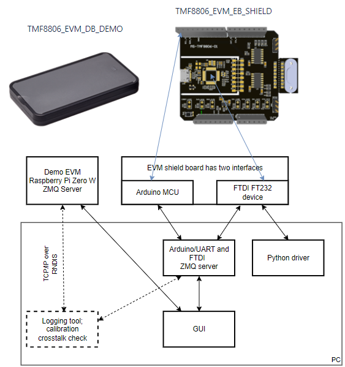

Introduction
============

This archive contains the TMF8806 ZeroMQ client software and data logger example programs.

There are three examples:

 - a passive logger that can run in parallel to the TMF8806 EVM GUI
 - an active logger that configures the TMF8806 via ZeroMQ and starts the measurements
 - a logger example with custom log output that records calibration and cross-talk information

To run these examples you must have a TMF8806 Raspberry Pi EVM connected. 
Or you can use a TMF8806 shield board with the matching ZeroMQ server. 
You must have the zmq_client Python Package installed.



Setup
=====

It's recommended to use a Python virtual environment.

Example (Powershell):
```
    > python -m venv .venv-test
    > ./.venv-test/Scripts/Activate.ps1
    > pip install zmq_client-1.5.0.tar.gz
    > python example_zmq_client.py
```

Running the logger with a local ZeroMQ server
=============================================

If you want to log data from a ZeroMQ server running on your laptop (FTDI or Arduino setup) please change:

```
CMD_SERVER_ADDR = "tcp://169.254.0.2:5555"
RESULT_SERVER_ADDR = "tcp://169.254.0.2:5556"
```

to

```
CMD_SERVER_ADDR = "tcp://127.0.0.1:5555"
RESULT_SERVER_ADDR = "tcp://127.0.0.1:5556"
```


